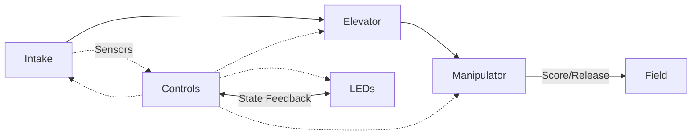
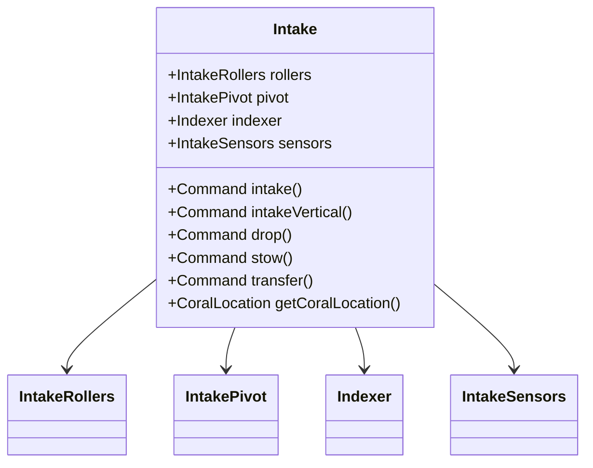
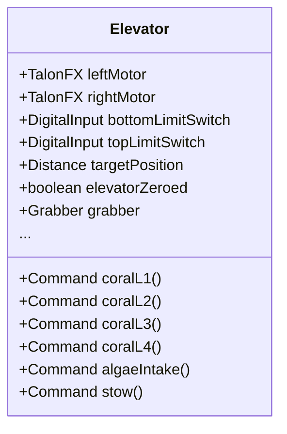
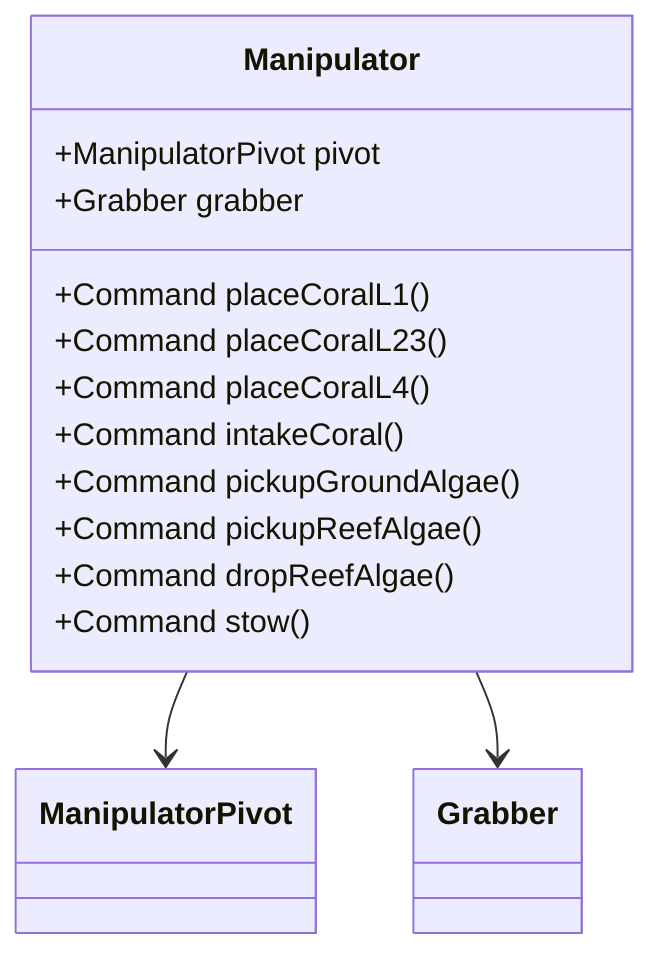
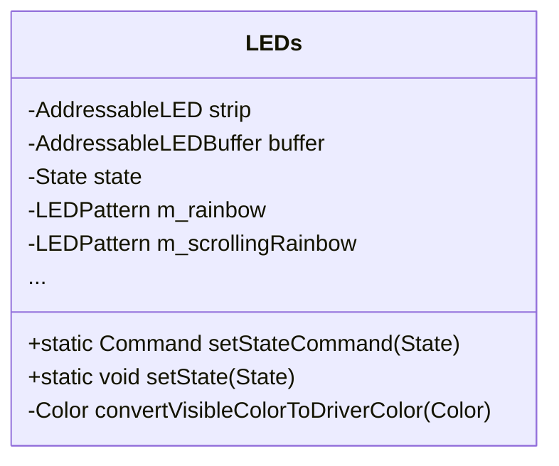
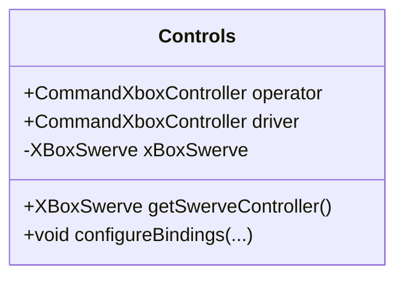

# Robot Subsystems – Detailed Summary

## Table of Main Subsystems

| Subsystem       | Main Purpose & Responsibilities | Key Properties           | Key Methods/Commands                |
|-----------------|--------------------------------|-------------------------|-------------------------------------|
| **Intake**      | Collect coral from ground; controls rollers, pivot, sensors | `rollers`, `pivot`, `indexer`, `sensors` | `intake()`, `intakeVertical()`, `drop()`, `stow()`, `transfer()`, `getCoralLocation()` |
| **Elevator**    | Elevate coral to scoring heights; ensure closed-loop position; limit switches for safety | `leftMotor`, `rightMotor`, `bottomLimitSwitch`, `topLimitSwitch`, `targetPosition` | `coralL1()`, `coralL2()`, `coralL3()`, `coralL4()`, `algaeIntake()`, `stow()`, etc. |
| **Manipulator** | Secure and place coral; manipulates coral/algae via grabber and pivot | `pivot`, `grabber` | `placeCoralL1()`, `placeCoralL23()`, `placeCoralL4()`, `intakeCoral()`, `pickupGroundAlgae()`, `pickupReefAlgae()`, `dropReefAlgae()`, `stow()` |
| **LEDs**        | Show robot state, feedback, and visuals for drivers | `strip`, `buffer`, `state`, color/pattern constants | `setStateCommand(state)`, `setState(state)`, custom pattern/gradient creation         |
| **Controls**    | Handle driver/operator input, map buttons, setup command bindings | `operator`, `driver`, `xBoxSwerve` | `configureBindings(...)`, `getSwerveController()`                                     |

---

## Interactions Diagram

---

## Subsystem Class Diagrams

### Intake Subsystem (src/main/java/frc/robot/subsystems/intake/Intake.java)

### Elevator Subsystem (src/main/java/frc/robot/subsystems/elevator/Elevator.java)

### Manipulator Subsystem (src/main/java/frc/robot/subsystems/manipulator/Manipulator.java)

### LEDs Subsystem (src/main/java/frc/robot/subsystems/leds/LEDs.java)

### Controls Subsystem (src/main/java/frc/robot/subsystems/Controls.java)

---

## Notes

- The class diagrams above show relationships and key commands/properties; see the [full source files](https://github.com/snehalmthakkar/Code-2025/tree/main/src/main/java/frc/robot/subsystems) for all details.
- *Intake*, *Elevator*, and *Manipulator* subsystems use command-based architecture (WPILib) for sophisticated sequencing and safety.
- *LEDs* subsystem provides feedback synchronized with robot state (such as aligning, scoring, or error states).
- *Controls* subsystem is the gateway for all manual and autonomous control logic, safely invoking commands across all mechanical subsystems.

_These details are based on code search results. For full member and method listings, see individual Java files in your [subsystems directory](https://github.com/snehalmthakkar/Code-2025/tree/main/src/main/java/frc/robot/subsystems)._
